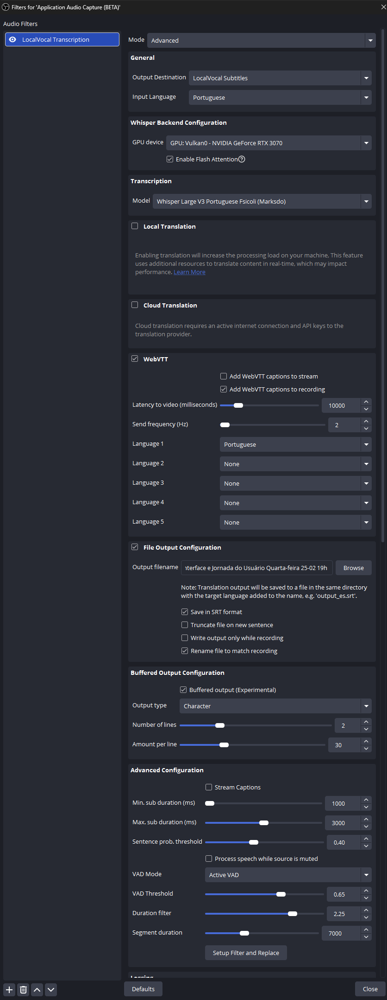
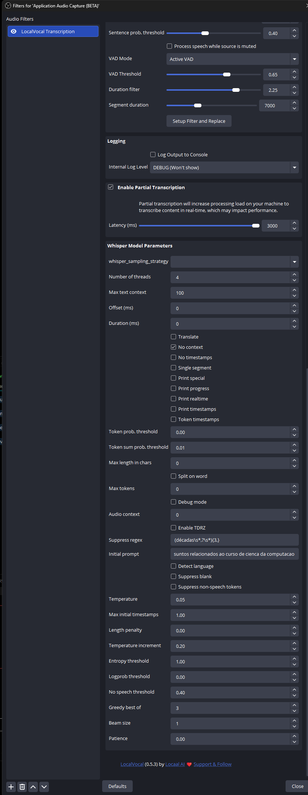

# OBS + LocalVocal — Configuração de referência

Plugin: **LocalVocal 0.5.3** (by Locaal AI)
Aplicado como filtro de áudio em: `Application Audio Capture (BETA)`

---

## Aba geral, WebVTT e saída de arquivo



| Seção | Parâmetro | Valor |
|-------|-----------|-------|
| **General** | Mode | Advanced |
| | Output Destination | LocalVocal Subtitles |
| | Input Language | Portuguese |
| **Whisper Backend** | GPU device | GPU: Vulkan0 – NVIDIA GeForce RTX 3070 |
| | Enable Flash Attention | ✓ |
| **Transcription** | Model | Whisper Large V3 Portuguese Fsicoli (Marksdo) |
| **WebVTT** | Enabled | ✓ |
| | Add WebVTT captions to stream | ✗ |
| | Add WebVTT captions to recording | ✓ |
| | Latency to video (ms) | 10000 |
| | Send frequency (Hz) | 2 |
| | Language 1 | Portuguese |
| **File Output** | Enabled | ✓ |
| | Save in SRT format | ✓ |
| | Truncate file on new sentence | ✗ |
| | Write output only while recording | ✗ |
| | Rename file to match recording | ✓ |
| **Buffered Output** | Enabled (Experimental) | ✓ |
| | Output type | Character |
| | Number of lines | 2 |
| | Amount per line | 30 |
| **Advanced Config** | Stream Captions | ✗ |
| | Min. sub duration (ms) | 1000 |
| | Max. sub duration (ms) | 3000 |
| | Sentence prob. threshold | 0.40 |
| | Process speech while source is muted | ✗ |
| | VAD Mode | Active VAD |
| | VAD Threshold | 0.65 |
| | Duration filter | 2.25 |
| | Segment duration | 7000 |

---

## Parâmetros do modelo Whisper



| Parâmetro | Valor | Nota |
|-----------|-------|------|
| **Enable Partial Transcription** | ✓ | |
| Latency (ms) | 3000 | Recomendado: 2000+ ou desativar para reduzir stalls de GPU |
| **Number of threads** | 4 | |
| Max text context | 100 | |
| **No context** | ✓ | Previne amplificação de contexto incorreto |
| Token prob. threshold | 0.00 | |
| Token sum prob. threshold | 0.01 | |
| **Suppress regex** | `(décadas\s*,?\s*){3,}` | Filtro inline para alucinações conhecidas |
| **Initial prompt** | assuntos relacionados ao curso de cienca da computacao | Ancora o modelo no domínio |
| **Temperature** | 0.05 | |
| Temperature increment | 0.20 | Recomendado: 0.10 — UI não permite valor menor |
| Max initial timestamps | 1.00 | |
| Length penalty | 0.00 | |
| **Entropy threshold** | 1.00 | Recomendado: 2.0–2.2 — UI não permite ultrapassar 1.00 |
| **Logprob threshold** | 0.00 | Recomendado: -1.0 — UI não permite valor negativo |
| No speech threshold | 0.40 | |
| **Greedy best of** | 3 | |
| **Beam size** | 1 | Beam alto aumenta alucinações em real-time |
| Patience | 0.00 | |
| **Logging** | DEBUG (Won't show) | |

### Parâmetros que ficaram abaixo do recomendado (limite do UI)

| Parâmetro | Configurado | Recomendado | Limitação |
|-----------|-------------|-------------|-----------|
| Entropy threshold | 1.00 | 2.0–2.2 | Slider do LocalVocal não vai além de 1.00 |
| Logprob threshold | 0.00 | -1.0 | UI não aceita valores negativos |
| Temperature increment | 0.20 | 0.10 | Valor mínimo permitido é 0.20 |

---

## Replicar no Linux

Para reproduzir este setup em outro ambiente (Linux + OBS):

1. Instalar o plugin LocalVocal: <https://github.com/locaal-ai/locaal-studio>
2. Baixar o modelo **Whisper Large V3 Portuguese Fsicoli (Marksdo)** via interface do plugin ou manualmente
3. Adicionar o filtro `LocalVocal Transcription` na fonte de áudio desejada
4. Configurar `Mode: Advanced` e aplicar todos os valores das tabelas acima
5. Backend: selecionar CPU ou o backend disponível (Vulkan só disponível com GPU compatível)
   - Em CPU, aumentar `Number of threads` para o número de cores disponíveis

> **Nota sobre o backend:** O problema de alucinação por stall de GPU (screenshot → spike → loop do modelo) é específico do backend Vulkan no Windows. No Linux com backend CPU ou CUDA, esse comportamento pode não ocorrer, mas o `Suppress regex` e o `Beam size = 1` continuam sendo boas práticas.

---

## Arquivo de saída gerado

O LocalVocal grava um `.srt` junto ao arquivo de vídeo do OBS.
Para limpar o `.srt` antes de passar ao LLM, use o pipeline do projeto:

```bash
python3 scripts/srt_to_vtt.py "Nome da Aula" --input aula.srt --output aula.vtt
python3 scripts/vtt_clean.py aula.vtt
```

Ver também: [`docs/localvocal-settings.md`](localvocal-settings.md) para a análise de alucinações e ajustes recomendados.
